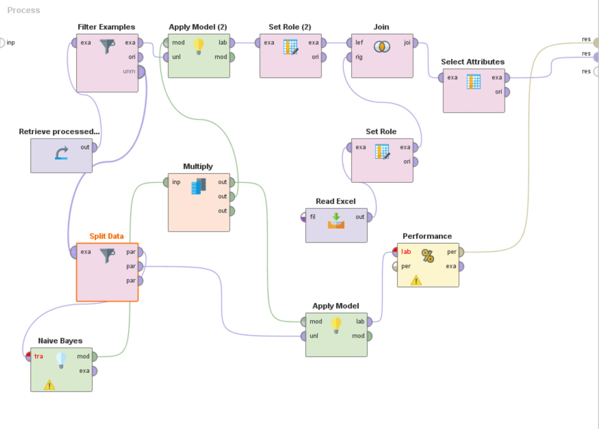

# Group8CapProject
This is our code for scraping social media, primarily twitter, for specific query terms. 
The codes in this repository will enable you to collect tweets, process them into a word document, and apply the naive bayes model to classify them and categorize them. 

